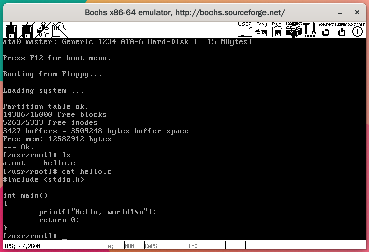
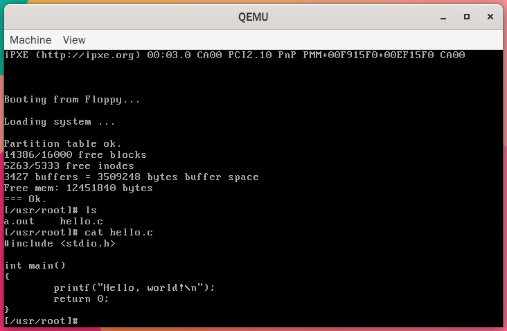
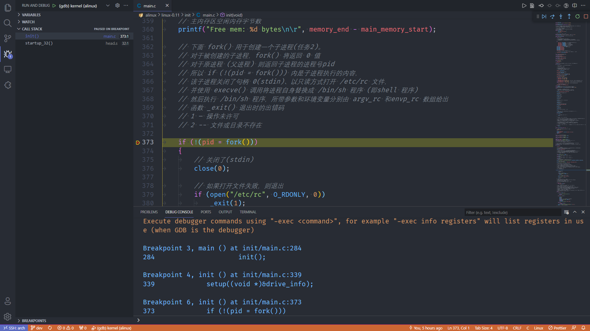

# alinux
Linux 源码分析

[本项目地址](https://github.com/StevenBaby/alinux)

## 配置开发环境

克隆代码，执行命令

    git clone https://github.com/StevenBaby/alinux.git

然后可以在 devel 目录执行

    make bochs

或者

    make qemu

来执行模拟程序；

如需要调试，则可执行：

    make bochsg

执行 `bochs-gdb` 然后再 vscode 中单步调试

具体实现的细节，请看 [配置开发环境](./docs/01%20配置开发环境.md)

## 硬件设备基础

- [硬件设备基础](./docs/硬件设备基础/readme.md)
- [软盘驱动器](./docs/硬件设备基础/01%20软盘驱动器.md)
- [硬盘驱动器](./docs/硬件设备基础/02%20硬盘驱动器.md)
- [VGA 显示器](./docs/硬件设备基础/03%20VGA%20显示器.md)

## 源码解析

- [配置开发环境](./docs/01%20配置开发环境.md)
- [启动引导程序](./docs/02%20启动引导程序.md)

## 参考资料

- [参考资料](./docs/参考资料.md)