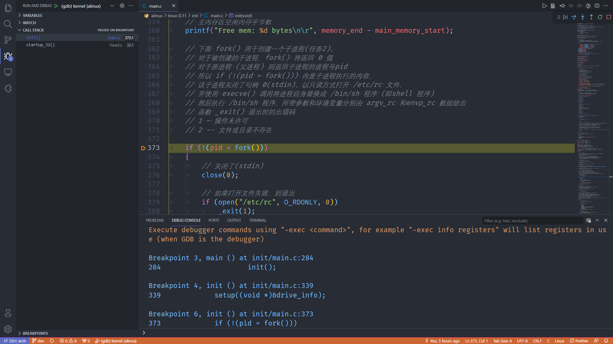

# 配置开发环境

## bochs

如果只进行模拟的话，可以直接安装 bochs

    pacman -S bochs

不过，目前(2021-08) 官方 bochs 有 bug，也就是点击 Stack 及其他功能时，会卡死；

遂附赠安装程序补丁包，及 `PKGBUILD` 在 `devel/bochs` 目录中，执行：

    makepkg -si

即可安装。

安装完成之后，可在 `devel` 目录中执行：

    make bochs

即可模拟操作系统


---

## qemu

安装 `qemu` 的方式比较简单，只需要执行如下命令即可：

    pacman -S qemu
    pacman -S qemu-arch-extra

其中 `qemu-arch-extra` 有众多其他架构的模拟器，最重要的就是 `qemu-system-i386`，我们需要这个。

安装完成之后，可在 `devel` 目录执行：

    make qemu

即可模拟操作系统


> 希望以后可以实现以下其他架构，比如 arm 😄

---

## bochs-gdb

如果已经配置了 `bochs-gdb` 可以首先在 主机上执行 `make bochsg`，此时，bochs-gdb 会处于等待连接的状态。

然后在 vscode 中点击 `F5`，开始对内核的单步调试。

### Archlinux 的安装方法

可在 `devel/bochs-gdb` 目录直接执行命令:

    makepkg -si

安装完成之后，就会有 `bochs-gdb` 命令。

---

注：默认 bochs 模拟时，会在 PageFault 的情况下中断，所以使用 `SIGUSR2` 来替代默认的信号 0。

我当前 gdb 的版本是 10.1，通过研究 gdb 源码找到了 `SIGUSR2` 定义的数字是 `31`，定义在文件 `/gdb/alpha-linux-tdep.c` 中的枚举 `ALPHA_LINUX_SIGUSR2 = 31`，这个与 bochs 源码中定义的有所不同，不过目前看起来一切运行良好。

`fix-build.patch` 经过了优化，去掉了 PageFault 信号在 gdb 中引起的中断；不过首先需要在 gdb 中执行：

    [-exec] handle SIGUSR2 nostop noprint nopass

其中 `-exec` 是 vscode 中的必要选项，也可以在 vscode `launch.json` 文件 setupCommands 中加入下面的内容：

```json
{
    "description": "ignore SIGUSR2 signal",
    "text": "handle SIGUSR2 nostop noprint nopass"
}
```

目前不知道这样做的其他后果，对于 gdb 的调试功能还不是很清楚，这里需要做进一步研究。

安装完成之后，可在 `devel` 目录执行：

    make bochsg

启动 bochs，然后就可以在 vscode 中调试了，效果如下：



---

## 关于 hda.img 的处理

由于实现提交了 根文件系统 `hda.img`，但是开发调试的过程中会改动 hda.img，但是我又不想再提交这个文件，于是可以执行下面的命令来再 `git commit` 时去掉该文件。

    git update-index --no-assume-unchanged hda.img

## 参考资料

- <https://stackoverflow.com/questions/7527982/applying-gitignore-to-committed-files>
- bochs与gdb联调时忽略 page fault 信号  
    <https://ultraji.xyz/2019/03/bochs_gdb_page_fault.html>
- diff & patch 制作及打补丁  
    <https://blog.csdn.net/u011784994/article/details/52944636>
