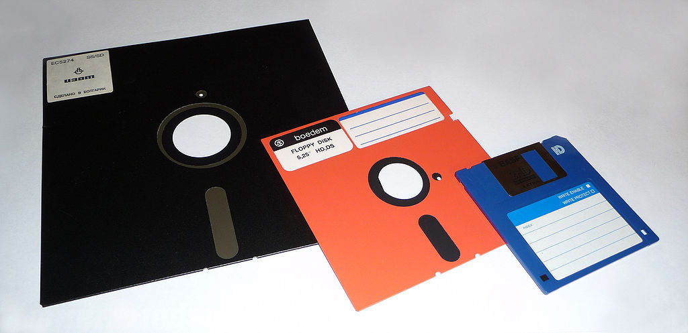

# 软盘驱动器

## 背景

软盘 (Floppy Disk) 是一种碟盘存储，主要部分是一张薄软的磁存储介质盘片，盘片封装在矩形塑料壳中，内衬有用于清理灰尘的纤维织物。读写软盘需要借助软盘驱动器。

第一个软盘是由 IBM 于 1971 年开发出的，直径 8 英寸（上图黑色的软盘）。随着硬件技术的发展与使用的需要，又派生出 5.25 英寸的软盘（上图中橙色的软盘），并广泛使用在 Apple II、IBM PC 及其他兼容电脑上。苹果 1984 年在Mac 机开始采用 3.5 英寸软盘，此时容量还不到 1MB，后来，由日本索尼的 3.5英寸软盘片容量有 1.44MB 所取代，这种软盘在 80 至 90 年代盛行，直至 2000 年代以前，3.5 英寸软盘驱动器仍是电脑普及设备之一，但是在1998年后渐渐被淘汰。

> 注：1英寸 = 2.54 厘米

软盘直至 2000 年代仍为电脑必备设备之一，因为把它制作成电脑引导碟以及更新 BIOS 时需要用到。但是由于软盘读取方式的局限，磁头在读写软盘资料时 **必须接触碟片**，而不是像硬盘那样 **悬空读写**，因此软盘已经难以满足大量和高速的资料存储，而且软盘的存储稳定性也较差，一张正常的软盘，容易受到外界环境影响，如受热、受潮、多次读写，均使之寿命减少。后来虽然有很多升级产品如 zip Drive、 SuperDisk（LS-120） 及 Jaz Drive 等，但是都难以同时解决兼容性和速度容量两者直接的矛盾。随着光盘、U盘、移动硬盘等移动存储接口的应用，5.25 英寸及 8 英寸的软盘已极为罕见，3.5 英寸的软盘使用也渐被淘汰。

2010年代，尽管大多数大厂已经宣布不再生产软盘驱动器，然而，仍有厂商推出传统内接式或是 USB 接口的外接式软盘驱动器，以供应市场上的需求，软盘片之所以在市场上仍占一席之地，系因在许多的企业、政府机关、研究单位，仍然需要在一些较旧型电脑或工业电脑等特殊环境使用软盘驱动器来做资料文件的传输。

## 尺寸

| 软盘类型 | 尺寸(毫米)          | 容量    |
| -------- | ------------------- | ------- |
| 8        | 203.0 x 203.0 x 1.6 | 242 KB  |
| 5.25     | 133.3 x 133.3 x 1.6 | 1.2 MB  |
| 3.5      | 93.7 x 90.0 x 3.3   | 1.44 MB |

## 种类

> 注：通常
>   - **磁道** 和 **柱面** 是同义词
>   - **盘面** 和 **磁头** 是同义词

- 5.25英寸软盘
  - 160kB，单面 / 40 磁道 / 8扇区
  - 180kB，单面 / 40 磁道 / 9扇区
  - 320kB，双面 / 40 磁道 / 8 扇区
  - 360kB，双面 / 40 磁道 / 9 扇区
  - 1.2MB，双面 / 80 磁道 / 15 扇区
- 3.5英寸软盘
    - 360kB，单面 / 80 磁道 / 9 扇区
    - 720kB，双面 / 80 磁道 / 9 扇区
    - 1.44MB，双面 / 80 磁道 / 18 扇区
    - 2.88MB，双面 / 80 磁道 / 36 扇区

### 扇区寻址方式

软盘驱动器只能使用 CHS (Cylinders Heads  Sector) 的寻址方式，默认总是有两个磁头，但是驱动器需要知道多少有多少磁道和多少扇区。

典型的，通常使用的 1.44M，3.5 寸软盘有 80 磁道，每磁道有 18 扇区。

磁道和磁头从 0 开始计数，而扇区从 1 开始计数

但是，很多逻辑地址是以 LBA(Logical Block Address) 模式记录的，也就死从逻辑上将所有的扇区排序，第一个扇区编号为 0，两种模式的转换方式如下：

- HPC - (Head Per Cylinders) / 每柱面磁头数
- SPT - (Sector Per Track) / 每磁道扇区数

---

> 逻辑扇区地址 = (( 第几个柱面 * 柱面对应的磁头数 + 第几个磁头 ) * 每磁道扇区数 ) + 第几个扇区 - 1

假设我们从头到尾将磁盘的所有扇区都写满，

- 先选择没有写满的柱面，这样相当于选择了好几个磁道，这些磁道在不同盘面的同一个位置
- 再从这些磁道中选择一个没有写满的磁道，相当于选择一个磁头。
- 再从这个磁道中选择没有写入的扇区

> 这里说一个 **错误** 的直观感觉：
> 
> 对我来说，直观的感觉应该是先选择一个盘面可劲儿的写，写完这个盘面，然后再选择下一个盘面，然后再写；如果磁盘是好多个盘面垒起来的圆柱体，这种方式就像是先从下往上，再从外向内，依次写入，有点像一楼写满了，再写二楼；从逻辑上来说可以这么做，但是却没有，事实不是这样的；
>
> 下面是 **正确** 的
> 
> 应该是先选择柱面，然后选择磁道。如果磁盘还是上面的圆柱体，这种方式就像是 先从外向内，再从下到上依次写入；
> 
> 这么做的主要原因是，**磁盘的主要性能瓶颈是寻道时间**，也就是移动磁头的时间，如果以上面那种方式写的话，就需要频繁的移动磁头，这样就会拖慢性能。而下面这种方式，在写满所有盘面的同一磁道时不需要移动磁头，只有写完所有磁道之后，才需要移动磁头，所以就会比较快。

## 参考资料

- <https://en.wikipedia.org/wiki/Floppy_disk>
- <https://www.fileformat.info/media/measurements.htm>
- <https://wiki.osdev.org/Floppy>