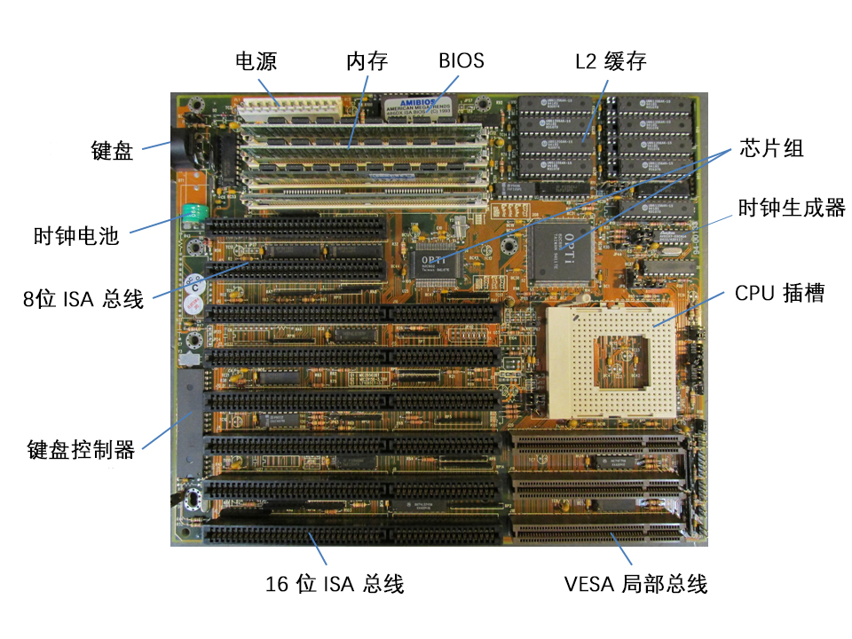
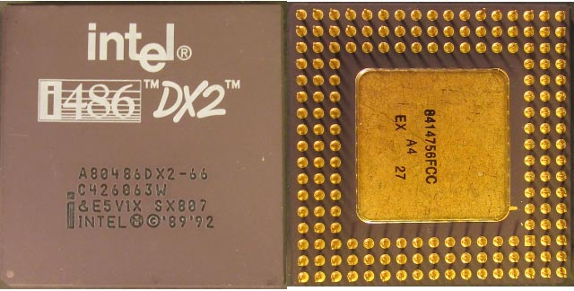
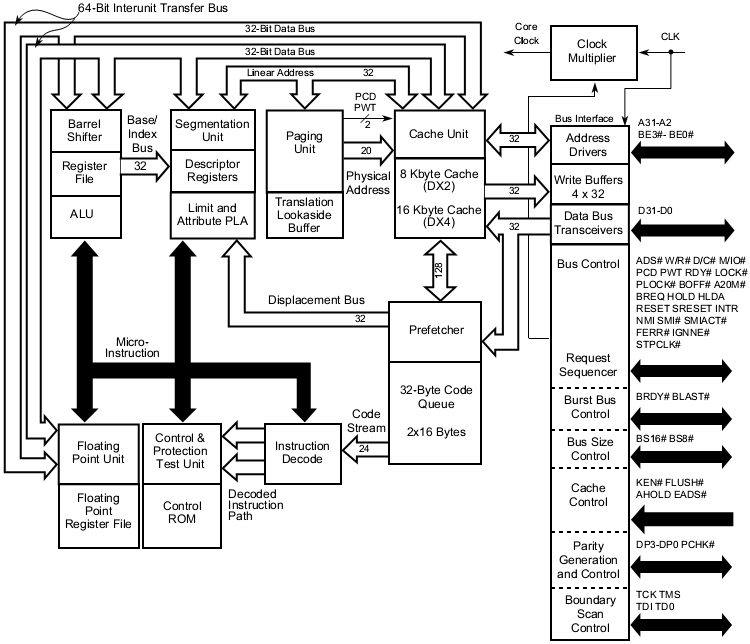
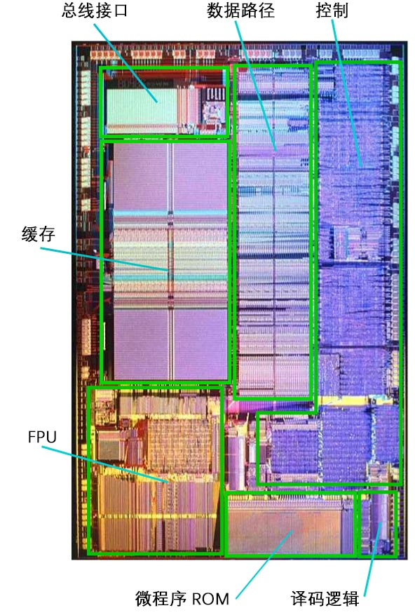
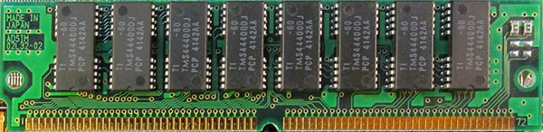

# 硬件设备基础

这里介绍必要的硬件，一些背景知识。可以在大环境上烘托出一种气氛。

由于 Linux 0.11 对于计算机来说已经是好几个地质纪年之前的事情了，所以有必要回到那个年代，来感受一下当时的硬件设备，以及对现代计算机的影响。

我们主要的 CPU 还是以 Intel 80486 为主，所以我觉得我需要了解以下与 80486 相关的一些硬件，操作系统是用来直接操作硬件的软件系统，所以了解硬件实现的细节挺重要的，不过这部分内容对于计算机专业来说不是那么容易，更偏向电子相关的专业，需要处理很多电器工程的问题。 

> 以下内容可能有误，我无从试验，主要是从网络摘抄的！！！

## 主板 (80486)

## CPU

## 内存

---

## 芯片组

## BIOS

## 键盘及控制器

## 时钟生成器

## 二级缓存

## I/O 端口映射

IO 端口通常用作 x86 IO 总线上的一个特定地址，总线为设备提供一种固定大小和顺序的通信方式，是一种内存映射的替代方式。在许多其他的架构中，并没有预定义的总线来作类似的通信，而是使用内存映射的方式。它同样越来越多地出现在现代 x86 硬件中。

如果你发现了一个端口号，但是不知它作何之用，这里是一个常用端口号的列表：

| 端口号范围      | 描述                          |
| --------------- | ----------------------------- |
| 0x0000 ~ 0x001F | 第一 DMA 控制器，一般用于软盘 |
| 0x0020 ~ 0x0021 | 第一可编程中断控制器          |
| 0x0040 ~ 0x0047 | 可编程定时器                  |
| 0x0060 ~ 0x0064 | 键盘和鼠标                    |
| 0x0070 ~ 0x0071 | 实时时钟                      |
| 0x0080 ~ 0x008F | DMA (Page registers)          |
| 0x0092          | 快速 A20 门                   |
| 0x00A0 ~ 0x00A1 | 第二可编程中断控制器          |
| 0x00C0 ~ 0x00DF | 第二 DMA 控制器，一般用于声卡 |
| 0x0170 ~ 0x0177 | 从硬盘控制器                  |
| 0x01F0 ~ 0x01F7 | 主硬盘控制器                  |
| 0x0278 ~ 0x027A | 并口                          |
| 0x02F8 ~ 0x02FF | 第二串口                      |
| 0x03B0 ~ 0x03DF | IBM VGA                       |
| 0x03F0 ~ 0x03F7 | 软盘控制器                    |
| 0x03F8 ~ 0x03FF | 第一串口                      |

---

## ISA 总线

ISA总线： (Industry Standard Architecture:工业标准体系结构）是为 PC/AT 电脑而制定的总线标准，为 8/16 位体系结构，只能支持 16 位的 I/O 设备，数据传输率大约是 16MB/s。也称为 AT 标准。

---

## VESA 局部总线

VESA 局部总线是由 60 家附件卡制造商联合推出的一种局部总线，简称为 VL(VESA local bus) 总线。

它的推出为微机系统总线体系结构的革新奠定了基础。

VESA 总线主要目的是用于视频插卡，以提高视频性能。

该总线系统考虑到 CPU 与主存和 Cache 的直接相连，通常把这部分总线称为 CPU 总线或主总线，其他设备通过 VL 总线与 CPU 总线相连，所以 VL 总线被称为局部总线。

它定义了 32 位数据线，且可通过扩展槽扩展到 64 位，使用 33MHz 时钟频率，最大传输率达 132MB/s，可与 CPU 同步工作。是一种高速、高效的局部总线，可支持 386SX、386DX、486SX、486DX 及 奔腾微处理器。

---

## 其他细节

- [软盘驱动器](./01%20软盘驱动器.md)
- [硬盘驱动器](./02%20硬盘驱动器.md)
- [VGA 显示器](./03%20VGA%20显示器.md)

## 参考资料

- <http://eessential.blogspot.com/2014/02/80486-pc-motherboard.html>
- <http://eessential.blogspot.com/2014/02/80486-pc.html>
- <https://bochs.sourceforge.io/techspec/PORTS.LST>
