# x86 体系结构

我们所研究的是 x86 体系结构，那么有必要先研究一下英特尔的 CPU，机器相关的架构，这样我觉得可能会好一点。

## 英特尔 CPU 历史

### 8086: x86 的始祖

Intel 第一款 16 位的处理器，比起之前的处理器在性能上有了很大的提升，不仅仅是时钟频率的提升，而且使用了 16 位的外部数据总线和更长的 6字节预取指队列，使得它可以运行 16 位的任务（尽管当时的大多数软件是为 8 位处理器而设计的），地址总线被扩展到 20 位，使得 8086 可以访问 1MB 的内存而因此提升性能。

8086 同样是 x86 系列的第一块处理器，使用了第一版的 x86 指令集 (ISA Instruction Set Architechiture)

### 80386

Intel 第一块 32位处理器是 80386，于 1985 年发布。一个关键的优势是它有 32 位的地址总线允许访问 4GB 的内存空间。因此它在发布的时候，远远大于同时代的处理器。内存的限制常常是引发性能问题的关键，不像当代的CPU，在 80386 处理器发布时，更多的内存总是被认为是更高的性能。

### 80486: 集成了 FPU

80486 是另一个提升性能的关键，关键在于成功的在CPU中集成了更多的组件，80486 是第一个有 L1 缓存的处理器。

80486 还集成了 FPU(浮点处理单元) 和 MMU (内存管理单元)

## 参考资料

- The History Of Intel CPUs: Updated!
    <https://www.tomshardware.com/picturestory/710-history-of-intel-cpus.html>
- <https://en.wikipedia.org/wiki/List_of_Intel_processors>
